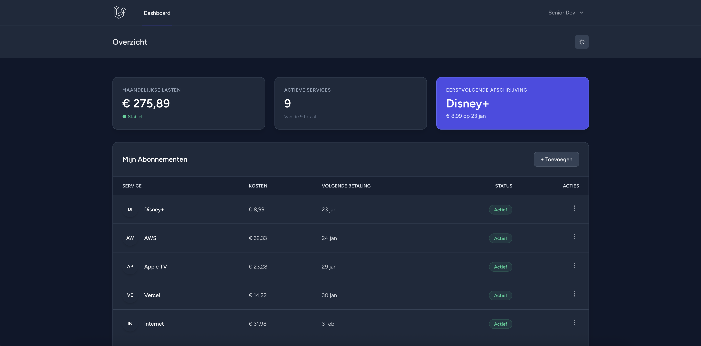

# SubTrackR - Subscription Management SaaS 🚀

Een moderne full-stack applicatie om maandelijkse abonnementen bij te houden. Gebouwd met focus op Clean Code, moderne UI/UX en een robuuste architectuur.


(public/screenshots/dashboard-preview2.png)

## 🛠️ Tech Stack

- **Backend:** Laravel 11 (PHP 8.2+)
- **Frontend:** React 18
- **Bridge:** Inertia.js (Monolith SPA)
- **Styling:** Tailwind CSS + Shadcn/UI concept
- **Database:** MySQL / SQLite

## ✨ Key Features

- **Authentication:** Veilige login en registratie flow (Laravel Breeze).
- **CRUD Operations:** Volledig beheer van abonnementen (Toevoegen, Wijzigen, Verwijderen).
- **Dark / Light Mode:** Dynamische thema-wisselaar met local storage persistence.
- **Responsive Design:** Werkt naadloos op desktop en mobiel.
- **Real-time Feedback:** Validatie van formulieren en dynamische KPI kaarten.

## 🏗️ Architectuur Keuzes

Ik heb gekozen voor **Inertia.js** om de snelheid van een Single Page Application (SPA) te combineren met de kracht van Laravel's routing en controllers. Dit elimineert de noodzaak voor een complexe API laag voor interne data.

Het datamodel maakt gebruik van Eloquent relaties (`User hasMany Subscriptions`) en strikte validatie via FormRequests om data-integriteit te waarborgen.

## 🚀 Hoe te draaien (Lokaal)

1.  **Clone de repo**

    ```bash
    git clone [https://github.com/JOUWNAAM/SubTrackR.git](https://github.com/JOUWNAAM/SubTrackR.git)
    cd SubTrackR
    ```

2.  **Installeer dependencies**

    ```bash
    composer install
    npm install
    ```

3.  **Setup Environment**

    ```bash
    cp .env.example .env
    php artisan key:generate
    touch database/database.sqlite
    ```

4.  **Migraties & Seeders**

    ```bash
    php artisan migrate:fresh --seed
    ```

5.  **Start de servers**
    ```bash
    npm run dev
    php artisan serve
    ```

---

_Gemaakt als Portfolio Project - 2026_
